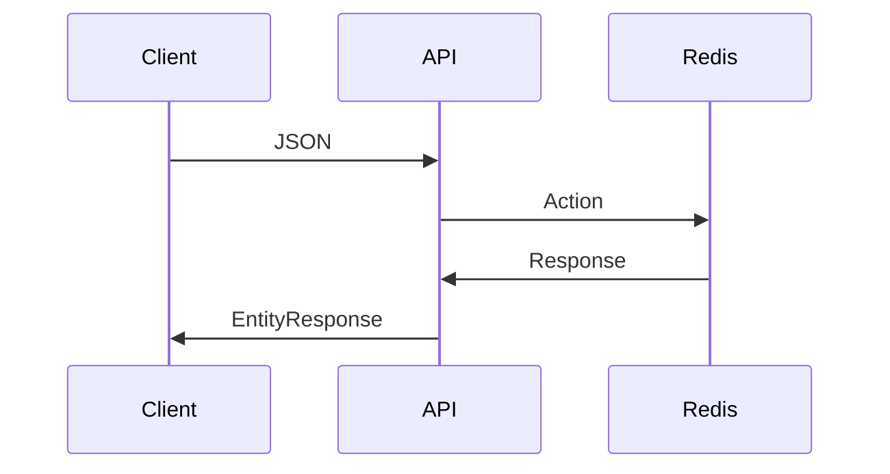

# Welcome to Customer Integration L&D!

So a few people have spoke about mini hack events and team L&D sessions. We had a conversation during a retro that we should have a session or two focussed on the tech that we have been thrown head first into and learn more about it in a collaborative environment and see how it works out and if people benefit from it.

## What?

So what are we going to be doing? So the majority of us have been using Kotlin and Spring Boot on the Nexus for Orwell project so the first part of this project is building on that knowledge. We are going to be building a simple Spring Boot application which contains a RESTful API and associated operations. In future sessions we're going to Dockerise all the things, run them on Kubernetes, getting some ElasticSearch on the go and who knows where else.


The point of this isn't to build something perfect. Its to get something up and running quickly that we can reuse and build upon. There’s no code reviews, no judging of each other’s code...nothing like that! We’re learning!

## Why?
When times are tight and you're learning new things, you don't learn them properly. You don't fully understand why you're doing what you're doing. You do things because other people tell you to because they know and you’re like “I have no f*****g idea what that does or why it’s doing it”...these sessions are to break those things down and one of the ways people learn the best is building something they already know the inner workings of so they understand the direction and the new things that are being learned fall into place.

## When?

Right now, and over future L&D's.

## Lets get started!

Download Postman or Insomina!

So first of all we need to generate a Spring Boot project. The quickest and easiest way to get a Spring Boot project up and running is use https://start.spring.io/. This site allows us to choose dependencies, language etc.

Choose a Group such as `com.djk` and an artifact such as `PROJECT_NAME`. We need 5 dependencies `Web`, `Redis`, `Actuator` and `DevTools`. 

## Spring Boot

Spring Boot is part of the Spring Framework, which is a Java application framework.

Spring Boot is a **"Convention-over-configuration rapid application development"** solution for creating stand-alone, production grade applications that just run.

So one of the main goals of this session is to give people more of an understand of what Spring Boot is.

Spring Boot is now SB (I got bored of writing Spring Boot)

So, SB makes getting started with Spring quick and easy. You don't have to understand everything behind the scenes and as you understand more, and become more knowledgeable, you can circle your way back and learn more about what’s actually going on.

SB is full featured and is heavily utilised in production by many companies today.

SB is a project within the larger Spring family. It can be used for both web and non-web applications.

Is it built on top if what is called the Spring Framework, so it contains a number of key features that make it unique and easy to use.

## Notable Features of Spring Boot

 - Auto Configuration

SB will automatically configure and setup an application based on the dependencies added to it as well as hints provided by the people building the application.
 
 - Standalone...applications that just run!

 SB is standalone. You don't need to deploy the application anywhere special, you can just run it. Think of IIS with .NET applications or Glassfish with Java EE projects. SB packages the application in a `.jar` file and runs the application. SB runs an embedded web server within the application with some basic defaults such as a port number and logging levels and then serves up the application...ready for use!
 
 - Its bloody opinionated!
 
Its has a chosen way of doing things by default. Anyone who has worked with Angular will know how this feels! But in this case...its actually a good thing! Sometimes we're literally drowning in choices and are to spoilt for choice and this is even worse when you're new to this stuff! SB removes this burden so that you can get up and running as quickly as possible which means more time writing code that solves a business problem!

## A bit on Annotations

In most typical applications, we have distinct layers like data access, presentation, service, business, etc.

And, in each layer, we have various beans. Simply put, to detect them automatically, **Spring uses classpath scanning annotations**.

Then, it registers each bean in the _ApplicationContext_.

Here’s a quick overview of a few of these annotations:

-   _@Component_  is a generic stereotype for any Spring-managed component
-   _@Service_ annotates classes at the service layer
-   _@Repository_  annotates classes at the persistence layer, which will act as a database repository

We can use @Component across the application to mark the beans as Spring’s managed components**.

@Repository_’s job is to catch persistence specific exceptions and rethrow them as one of Spring’s unified unchecked exception.

We mark beans with @Service to indicate that it’s holding the business logic. So there’s no any other specialty except using it in the service layer.

## Basic Application Structure

So `Packages` are a way to sort and store our Kotlin files. So we could have a `config` package which would store all our configuration...we could have a package called ‘data’ which contain our database logic or something like that.

So we need open IntelliJ, open our project and create 3 packages, `controller`, `model` and `repository`.

The `DevTools` dependency we installed allows us to run a continuous build so we don't have to keep stopping and starting the API when we make changes.

Open up a new iTerm session and split the session in two. Change directory to the root of our Kotlin project and run `gradle build --continuous`
and `gradle bootRun` once the build has finished. We can leave these two processes for the foreseeable. 

We need a Redis datastore up and running, we can use the below `docker-compose.yml` to get one up.

```yaml
version:  '3.1'

services:
	redis:
		image:  redis
		hostname:  redis
		ports:
			- "6379:6379"
		networks:
			- redis-net
		volumes:
			- redis-data:/data

networks:
	redis-net:
volumes:
	redis-data:
```
  
We then can run `docker-compose up` to bring up the database Make sure this is done in a new terminal window with the Gradle apps, did you know you can run `docker-compose up -d` to run in detached mode. Once Redis is up, connect across to the Container and run the Redis CLI.

## Basic Controller

The first thing we're going to be building in the Controller. 

A Controller is going to include functions that carry out a particular task such as authenticate a user or in our case interact with a DB.

Spring understands two types of Controllers, `Controller` and `RestController`. A `RestController` simplifies the creation of RESTful web services by combing annotations.

```kotlin
@RestController  
@RequestMapping("/api")  
class ActionController(private val actionRepository: ActionRepository) {
// stuff...
}
```
So we specify the `@RestController` annotation and we also include a `@RequestMapping`. Using the `@RequestMapping` annotation we specify the handler class and handler methods for our requests. So here we set the Request Mapping to `/api` which means that if a client was to hit our application at `http://localhost:8080/api` Spring would route the request into this Controller.

We are also using Dependency Injection here, we are injecting a Repository...we'll talk about this later.

# Models

Clients have to get data inside our API. In most cases than not this interaction is carried out using XML or JSON to model the data.

When a client sends JSON into a Spring API it tries to deserialise it....

Serialise to send....deserialise to receive :)

Behind the scenes Spring uses a popular package called Jackson to deserialise the JSON into Kotlin. As with most things Spring, we include an annotation to get the ball rolling, this time its the `@RequestBody` annotation. If we don't include this annotation Spring wont do any deserialisation. We also have to specify what we want Jackson to deserialise our payload to. So say we want to send the below JSON into our API:

```json
[{  
  "id": 24,
  "originalSels": [
  	492992622
  ],
  "derivedId": 493773141,
  "eventid": 23011448
},
{  
  "id": 25,
  "originalSels": [
  	492992622
  ],
  "derivedId": 493,
  "eventid": 23011448
}]
```
We want to turn this code into something we can work with. Thats were Models come in. They can also be called Domain Models or Domain Objects as they refer to the specific domain we are in. So Spring with all its magic can populate a Domain Model with this JSON data. So our domain model would look something like this:

```kotlin
// The RedisHash and the @Id annotation are responsible for  
// the value of the key.  
  
@RedisHash("Action")  
data class Action(  
    @Id  
 val id: Int,  
 val originalSels: List<Int>,  
 val derivedId: Int,  
 val eventId: Int  
)
```
So with that Model, we have to tell our Spring functions inside the Controller that invoke when we talk to the API to deserialise JSON into an Action or Actions.

## Controller Functions

So at the moment we have a Controller and Model. We aren't doing much.

When we hit our API with some JSON we want it to end up in Redis. We have to build some functions into our API to accept the requests from the client. Below is an example, there's a lot going on here...

```kotlin
@PostMapping("/actions")  
fun createNewAction(@RequestBody actions: Array<Action>) {  
    actionRepository.saveAll(actions.toMutableList())  
}
``` 
First of all we have an annotation...`@PostMapping("/actions")  `

This annotation is used for mapping HTTP `POST` requests onto our specific handler function. So if a client goes to `http://localhost:8080/api/actions` this function would be invoked. The function has a name, it can be anything but obviously related to the task it performs. Next we have the parameters...

`@RequestBody actions: Array<Action>`

Simply put, the `@RequestBody` annotation maps the `HttpRequest` body to a domain object. In turn, enabling automatic deserialisation of the inbound `HttpRequest` body onto a Kotlin object.

So in our case we are expecting a JSON payload containing an array of actions. If the deserialising is successful we can interact with `actions` as we would a normal Kotlin `List`.

```kotlin
@PostMapping("/actions")  
fun createNewAction(@RequestBody actions: List<Action>): List<Action> {  
    return actions  
}
```

## Is stuff working?
As we're auto building and running we don't have to do anything...yay!

If you open Postman and change the HTTP method to `Post` and paste in...

```json
[{  
  "id": 24,
  "originalSels": [
  	492992622
  ],
  "derivedId": 493773141,
  "eventid": 23011448
},
{  
  "id": 25,
  "originalSels": [
  	492992622
  ],
  "derivedId": 493,
  "eventid": 23011448
}]
```
And hit send hopefully we should see our data returned as a JSON response :)

## Getting our Actions into Redis

I'm a big fan of NoSQL databases...don't tell John ;)

I'm also a big fan of caching...but thats for another session.

So in our little scenario we want to dump our JSON in Redis as our service is going to be called a lot and round DB trips could hinder performance.

We need a way to get the JSON we post into our API into Redis and then we also need another function handler to get he data out of Redis.

This is where we need a `Repository`.

Below is an example...

```kotlin
@Repository  
interface ActionRepository : CrudRepository<Action, String>
```

We use the `@Repository` annotation to indicate that the class defines a data repository.

We then create an interface, give it a name, and in this case implement the `CrudRespository` interface.

`CrudRepository` extends Spring data `Repository` interface.

`CrudRepository` provides generic CRUD operations on a repository for a specific type. 

It has generic methods for CRUD operations. To use `CrudRepository` we have to create our interface and extend `CrudRepository`. We need not to implement our interface, its implementation will be created automatically at runtime. Find some of `CrudRepository` methods.  
  
`<S extends T> S save(S entity)`: Saves and updates the current entity and returns that entity.  
`Optional<T> findById(ID primaryKey)`: Returns the entity for the given id.  
`Iterable<T> findAll()`: Returns all entities.  
`long count()`: Returns the count.  
`void delete(T entity)`: Deletes the given entity.  
`boolean existsById(ID primaryKey)`: Checks if the entity for the given id exists or not.
